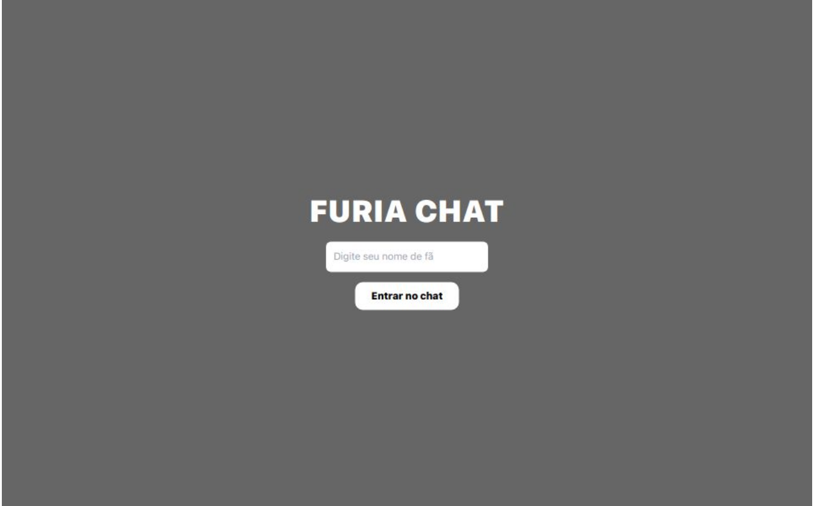

<h1 align="center"> Projeto Chat Furia</h1>

Chat Interativo para os Fãns da Furia

  <a href="#-tecnologias">Tecnologias</a>&nbsp;&nbsp;&nbsp;|&nbsp;&nbsp;&nbsp;
  <a href="#-projeto">Projeto</a>&nbsp;&nbsp;&nbsp;|&nbsp;&nbsp;&nbsp;
  <a href="#-deploy">Deploy</a>&nbsp;&nbsp;&nbsp;|&nbsp;&nbsp;&nbsp;

 

  

## 🚀 Tecnologias

🖥️ *FRONTEND*

 React.js — Framework JavaScript para criar a interface do chat. 

Tailwind CSS — Framework CSS para estilização rápida com classes utilitárias. 

uuid (v4) — Geração de ID único por usuário (npm install uuid). 

 WebSocket — Comunicação em tempo real com o backend. 

🧠 *BACKEND*

Node.js — Ambiente para rodar JavaScript no servidor. 

ws — Biblioteca WebSocket para Node.js (npm install ws). 

🎨 *MÍDIA E RECURSOS VISUAIS*

Logo da FURIA (imagem) — Inserida no topo do chat. 

Vídeo de fundo (timer de jogo/ambiente competitivo) — Adicionado ao topo com sobreposição. 

CSS personalizado — Para animações, posicionamento e responsividade dos elementos visuais. 

🌐 *HOSPEDAGEM E DEPLOY*

Vercel — Hospedagem do frontend com deploy automático a partir do GitHub. 

Localhost:8080 — Servidor WebSocket rodando localmente no backend. 

💻 Versionamento e Controle de Código

Git — Controle de versão local. 

GitHub — Repositório remoto para código e deploy. 

## 💻 Projeto

O FURIA Chat é um aplicativo web criado para promover a interação em tempo real entre fãs da equipe FURIA durante jogos, eventos e transmissões. A proposta surgiu como parte de um desafio com o objetivo de demonstrar habilidades em desenvolvimento web fullstack, com foco em comunicação instantânea e experiência do usuário envolvente. O projeto oferece um ambiente dinâmico, estilizado com a identidade visual da FURIA, incorporando WebSockets para troca de mensagens em tempo real, React no frontend e Node.js no backend.
Além disso, o FURIA Chat simula um ambiente de torcida, com design temático, vídeo de fundo em loop e personalização por usuário, reforçando o espírito de comunidade e emoção que envolvem o universo competitivo do eSports.

## 🔗 Deploy

Link do Projeto: https://projeto-furia-chat.vercel.app/

---

Feito por Guilherme Lins Oliveira.
